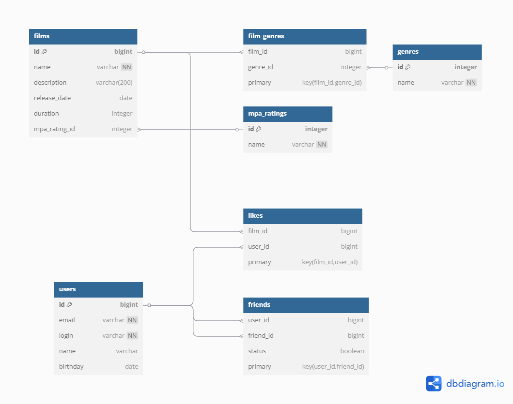

# java-filmorate
Template repository for Filmorate project.

## 🗄 Database Schema



### Основные таблицы
- `users` - информация о пользователях
- `films` - данные о фильмах
- `mpa_ratings` - справочник возрастных рейтингов
- `genres` - справочник жанров
- `friends` - связи дружбы между пользователями
- `likes` - лайки фильмов

### Примеры SQL-запросов

**1. Получение популярных фильмов:**
```sql
SELECT f.*, COUNT(l.user_id) AS likes_count
FROM films f
LEFT JOIN likes l ON f.id = l.film_id
GROUP BY f.id
ORDER BY likes_count DESC
LIMIT 10;
```

**2. Добавление друга:**
```sql
INSERT INTO friends (user_id, friend_id, status)
VALUES (1, 2, false)
ON CONFLICT (user_id, friend_id) DO UPDATE 
SET status = EXCLUDED.status;
```

**3. Поиск общих друзей:**
```sql
SELECT u.* 
FROM friends f1
JOIN friends f2 ON f1.friend_id = f2.friend_id
JOIN users u ON f1.friend_id = u.id
WHERE f1.user_id = 1 AND f2.user_id = 2;
```

**4. Получение фильмов по жанру:**
```sql
SELECT f.* 
FROM films f
JOIN film_genres fg ON f.id = fg.film_id
JOIN genres g ON fg.genre_id = g.id
WHERE g.name = 'Комедия';
```